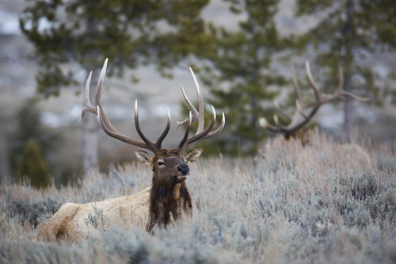
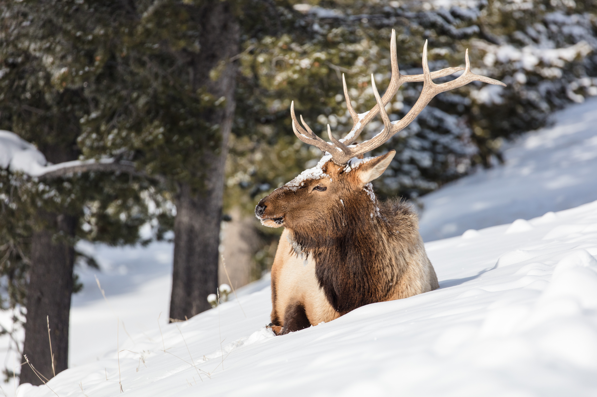

Thank you for checking out our analysis on Elk Migration in Yellowstone. Meet the team that created this project below!

## Brooklynn McNeil

Brooklynn is a part-time Environmental Health Data Science Masters Student at Columbia University. You can find her website [here](https://brooklynnrm.github.io/)

## Dylan Morgan

Dylan is a master's student in Environmental Health Data Science at Columbia University. You can find his website [here](https://dcm2192.github.io/)

## Tamara Pichardo

Tamara Pichardo is a master's student in Environmental Health Data Science at Columbia University. You can find her website [here](https://tpichardo7.github.io/tamara-pichardo.github.io/)

## Wayne Monical

Wayne Monical is a first-year master's degree student of Biostatistics at Columbia University. You can find his website [here](https://wayne-monical.github.io/)

## 

Photos were obtained from this [gallery](https://www.nps.gov/media/photo/gallery.htm?pg=1925497&id=F94243C9-1DD8-B71B-0B6A91B7B5171A35)