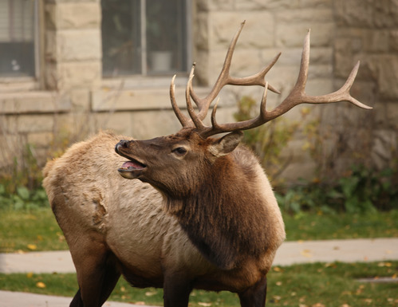
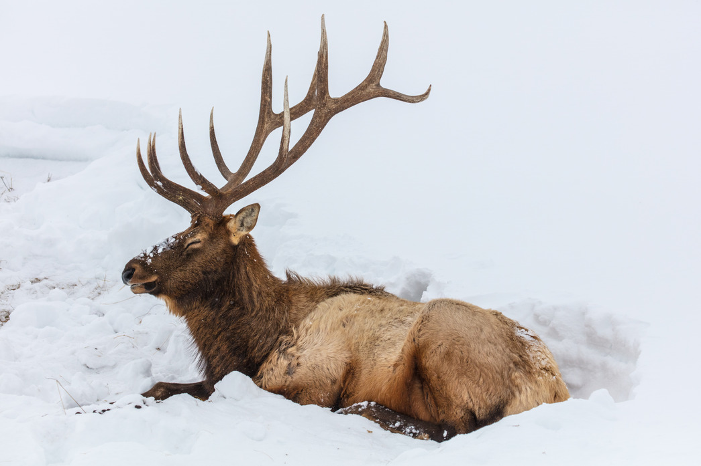
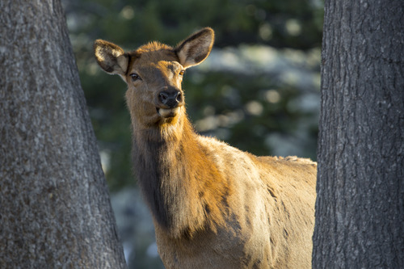
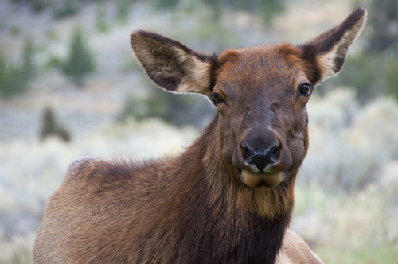

Thank you for checking out our analysis on Elk Migration in Yellowstone. Meet the team that created this project below!

## Brooklynn McNeil

You can find her website [here](https://brooklynnrm.github.io/)

Brooklynn is a part-time Environmental Health Data Science Masters Student at Columbia University.

```{r, echo=FALSE, fig.width = 10}

```

## Dylan Morgan

You can find his website [here]()

```{r, echo=FALSE, fig.width = 10}

```

## Tamara Pichardo

You can find her website [here]()

```{r, echo=FALSE, fig.width = 10}

```

## Wayne Monical

Wayne Monical is a first-year master's degree student of Biostatistics at Columbia University. You can find his website [here](https://wayne-monical.github.io/)

```{r, echo=FALSE, fig.width = 10}

```


Photos were obtained from this [gallery](https://www.nps.gov/media/photo/gallery.htm?pg=1925497&id=F94243C9-1DD8-B71B-0B6A91B7B5171A35)