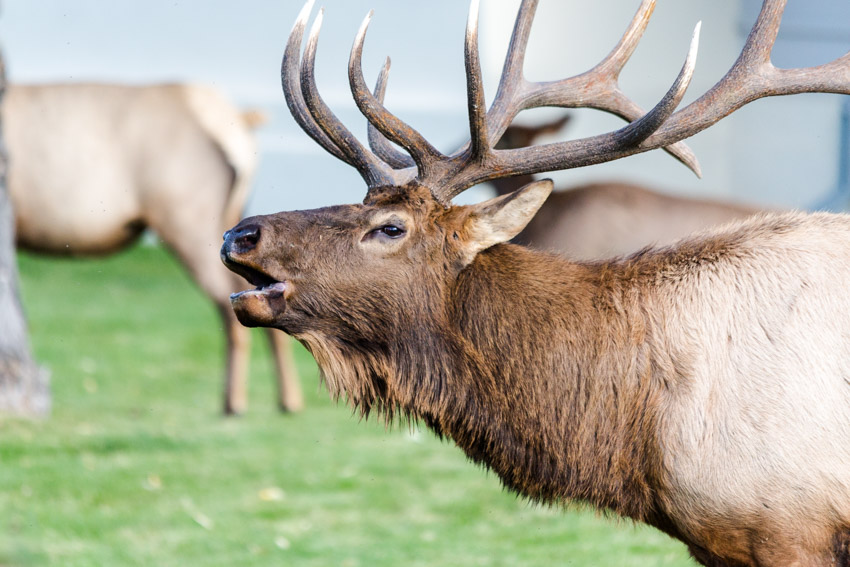

```{r, include = FALSE}
library(tidyverse)
```

```{r, include = FALSE}
# read data
```

---

### Welcome

```{r, echo=FALSE, out.width="60%", fig.align = 'center'}

```
<center style="font-size: 10px;"> Photo from:  https://www.yellowstone.org/ </center>
     
<br><br>                                       

Description of elk and why we are interested. 


<br><br>


---

### Screen cast 


#<iframe width="560" height="315" src="insert_youtube_video_here" title="YouTube video #player" frameborder="0" allow="accelerometer; autoplay; clipboard-write; encrypted-media; gyroscope; picture-in-picture; #web-share" allowfullscreen></iframe>

---


### Meet the Elk in Yellowstone

Hover over each point on the map to learn more about the name, age, and fur color of the squirrel spotted at that location!
```{r, fig.width= 8, fig.align='right'}

```


---


For more information about Yellowstone's Elk, check out these references: 

1. 
2. 