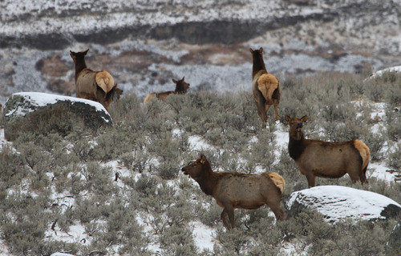

# Elk Expeditions: The Elk, the Environment, and the Evolving Migration in Yellowstone  

## Motivation  

Our project explores the dynamics of elk migration in the Grand Tetons and Yellowstone National Park. Inspired by our visits to national parks and our love for wildlife, we embarked on this project to combine interests in wildlife, the environment and our new found data science skills. Utilizing R's mapping capabilities, particularly the leaflet package, we aimed to create an interactive platform to visualize and analyze elk movement patterns.

To enrich our analysis, we incorporated complementary data sets on weather, land cover, and water quality, enabling us to investigate how these environmental factors influence elk migration. We explored temporal patterns, examining variations in migration year-over-year and across different seasons. This multidimensional approach allowed us to gain deeper insights into the behavior of these iconic animals and how they interact with their environment.

Through this project, we aimed not only to advance our technical expertise but also to foster appreciation and understanding of the intricate natural processes that unfold in these beloved landscapes.

## Related work  

Wildlife in Yellowstone peaked our interest largely due to the fact that its natural geography is so odd. It is laid on top of a *supervolcano* with many areas bubbling and boiling. While visiting the park this summer, we learned an odd fact that the biodiversity has suffered much less loss than neighboring areas and much of the world. This is largely why we wanted to study the animal movement and see if other environmental factors have affected migration patterns. 

## Questions  

Initial questions we had about the elk migration were:  

1.  Where do the elk move around in Yellowstone and the Grand Tetons National Parks?  
2.  Do the elk that are collared with GPS signal move individually or as a pack?  
3.  How does elk movement change over time of year and year to year.  
4.  How do environmental factors such as weather, land cover, soil chemistry, and soil temperature affect the elk's migration patterns?  

As the analysis evolved, we realized some data sources were more applicable than others. Some did not have enough data points or were not in the geographically area that we were interested in. Additional questions that we asked were:  

1.  Does temperature affect the distance traveled by the elk? What about rainfall, snowfall, and snow depth?  
2.  Does water quality factors, such as arsenic levels, affect the movement of the elk?  

## Data  

The elk data used in this project was provided by the United States Geological Survey (USGS), which utilized GPS collar tracking in the National Elk Rescue area near Yellowstone National Park and Grand Teton National Park, Wyoming, from 2006 to 2015. The data was comprised on 17 adult female elk, each of which had their daily locations tracked for 1-2 years. From this data source, we were able to map the pathways of each elk over time, which also allowed us to calculate the daily distance traveled among the elk subjects.  

Land cover data, also provided by USGS, was presented as a raster dataset that shows the distribution of vegetation, water, and bare rock throughout the study area in 2011, which falls near the midpoint of the 2006-2015 study period of this project. The data was presented by the GAP Analysis Project in Wyoming in 2019, and we were able to transform the raster data into their corresponding latitude and longitude coordinates, which allowed us to layer the elk migration pathways on top of the land cover data.  

Weather data, provided by the National Oceanic and Atmospheric Administration (NOAA) National Centers for Environmental Information (NCEI), featured daily weather station recordings (from 2006-2015) at four different stations that fell within the elk migration pathways and spanned wide portions of the study area. We primarily focused on total precipitation, snowfall, snow depth, and average temperature.  

Water quality data was obtained from datasets provided by the National Park Service, and featured water sample measurements containing various concentrations of water contaminants, such as arsenic, chloride, and magnesium, as well as other properties, such as dissolved oxygen content and pH. Among the water sampling sites considered, this project focused on data collected at two sites that fell within the migration pathways: `GRTE_SNR01` and `GRTE_SNR02`.  

## Exploratory Analysis  

```{r setup, include=FALSE, messages=FALSE}
knitr::opts_chunk$set(echo = TRUE)
knitr::opts_chunk$set(message = FALSE)
options(warn=-1)


library(geosphere)
library(leaflet)
library(leaflet.extras2)
library(lubridate)
library(RColorBrewer)
library(tidyverse)
library(terra)
library(ggmap)
library(plotly)
library(patchwork)
library(tidyterra)
library(patchwork)


knitr::opts_chunk$set(
  comment = '', fig.width = 8, fig.height = 6, out.width = "90%"
)

theme_set(theme_minimal() + theme(legend.position = "bottom"))

options(
  ggplot2.continuous.colour = "viridis",
  ggplot2.continuous.fill = "viridis"
)

scale_colour_discrete = scale_colour_viridis_d
scale_fill_discrete = scale_fill_viridis_d
```

```{r, messages=FALSE}
elk = read_csv("clean_data/elk.csv") |>
  mutate(elk_id = factor(elk_id)) 
```


```{r, messages=FALSE}
### Code for static maps

# API key
register_stadiamaps(key = '29074900-bb6e-4a71-8f91-454c28190f88',
                    write = FALSE)

min_lat = elk |> pull(lat) |> min()
max_lat = elk |> pull(lat) |> max()
rng_lat = abs(min_lat - max_lat)
lowerleftlat = min_lat 
upperrightlat = max_lat 

min_long = elk |> pull(long) |> min()
max_long = elk |> pull(long) |> max()
rng_long = abs(min_long - max_long)
lowerleftlon = min_long 
upperrightlon = max_long 


# Define area by `c(lowerleftlon, lowerleftlat, upperrightlon, upperrightlat)`
myLocation <- c(left = lowerleftlon,
                 bottom = lowerleftlat,
                 right = upperrightlon,
                 top = upperrightlat)


myMap <- get_stadiamap(
  bbox=myLocation,
  maptype = "stamen_terrain",
  crop=FALSE)
```


### Elk Movement

Looking at total elk movement by month, we see see a clear relationship. The months of May through October see consistent monthly travel of approximately 100 kilometers. The months of March, April, November, and December see highly varied travel distances, ranging from tens of kilometers to over three hundred. The elk have a consistent median travel distance of approximately 2.9 kilometers per day, though they may each travel up to 10 kilometers today. 

```{r, messages=FALSE, label = 'total_movement'}
total_movement =
  elk |>
  mutate(month = month(dt, label = TRUE)) |> 
  group_by(elk_id, year, month) |> 
  summarize(
    total_distance_km = sum(dist_km, na.rm = TRUE)
  ) |>
  ggplot(aes(x = factor(month), y = total_distance_km, fill = factor(month))) +
  geom_violin() + 
  labs(
    title = "Total Movement by Month",
    x = "Month", 
    y = "Total Distance Traveled (km)", 
    fill = "Month") +
  theme(legend.position = 'none')

daily_median = 
  elk |>
  mutate(date = date(dt)) |> 
  group_by(elk_id, date) |>
  summarize(daily_sum = sum(dist_km)) |>
  drop_na() |>
  pull(daily_sum) |>
  median()
  
daily_movemnt = elk |>
  mutate(date = date(dt)) |> 
  group_by(elk_id, date) |>
  summarize(daily_sum = sum(dist_km)) |>
  ggplot(aes(x = elk_id, y = daily_sum)) +
  geom_boxplot(outliers = FALSE) +
  geom_hline(yintercept = daily_median, color = "blue") +
  labs(title = "Daily Averages (km)",
       x = "Elk ID",
       y = "Distance (km)")

total_movement + daily_movemnt
```

Plotting the elk tracked in 2013 and 2014, we see a similar trend of movement as with the entire sample, wherein the months of March, April, November, and December see the largest amount of movement, though individual elk movement varies. 

```{r, messages=FALSE, label = 'elk_movement_2014'}

elk_monthly = 
  elk |> 
  filter(year %in% c(2013, 2014)) |> 
  mutate(
    month = month(dt, label = TRUE),  
  ) |>
  arrange(elk_id, dt)  

# Calculate distances and group by year, season, and elk_id
elk_distance_monthly = 
  elk_monthly |>
  group_by(elk_id, year, month) |>
  summarize(
    total_distance_km = sum(dist_km, na.rm = TRUE)
  ) |>
  ungroup() 


elk_distance_monthly |>
  ggplot(aes(x = as.numeric(month), y = total_distance_km, color = elk_id)) +
  geom_point() +
  geom_smooth(se = FALSE) +
  scale_x_continuous(
    breaks = 1:12,  # Numeric positions for each month
    labels = month.name  # Use month names as labels
  ) +
  labs(title = "Elk Movement by Month 2013-07-16 to 2014-12-30",
       x = "month",
       y = "total distance (km)")
```

Using leaflet, we can create a geographic figure showing the elk's movement around geographic features, such as mountains and lakes. We see that the elk began their migration close together, followed a similar path up to Jackson Lake, and then chose different paths. Elk 916 stayed close to the lake for the rest of the month. Elk 911, 914, and 917 seemed to stay together during the entire period. 

```{r, messages=FALSE, lebel = 'leaflet_elk'}
# Let's make a custom elk icon!!
elk_icon <- makeIcon(
  iconUrl = "pics/elk_icon.png", # Replace with the URL of your moose image
  iconWidth = 30, iconHeight = 30
)

filtered_data = 
  elk |> 
  filter(
    year %in% c(2013, 2014), 
    month == 5)

# Create a color palette (limited to 9 elk IDs for "Set1")
elk_ids = unique(filtered_data$elk_id)  # Get unique elk IDs
num_colors = length(elk_ids)    # Ensure we don't exceed palette limit
path_colors = colorFactor(palette = RColorBrewer::brewer.pal(num_colors, "Set1"), domain = elk_ids)

# Initialize leaflet map
map <- filtered_data |>
  group_by(elk_id) |>
  summarize(start_long = first(long), start_lat = first(lat),
            end_long = last(long), end_lat = last(lat))|>
  ungroup() |>
  leaflet() |>
  addProviderTiles(providers$CartoDB.Positron, group = "Base Map") |>
  addProviderTiles(providers$Esri.NatGeoWorldMap, group = "NatGeo Map") |>
  addMarkers(lng = ~start_long, lat = ~start_lat, icon = elk_icon, popup = ~paste("Start Point: Elk", elk_id)) |>
  addMarkers(lng = ~end_long, lat = ~end_lat, icon = elk_icon, popup = ~paste("End Point: Elk ", elk_id))

# Add lines for each elk's path
for (id in elk_ids) {
  elk_data <- filtered_data |> filter(elk_id == id)  # Subset data for each elk
  map <- map |>
    addPolylines(
      data = elk_data,
      lng = ~long, lat = ~lat,
      color = path_colors(id),  # Assign unique color for each elk
      weight = 2,
      opacity = 0.8,
      label = ~paste("Elk ID:", id)  # Label showing elk ID
    )
}

# Add a legend for the elk IDs
map <- map |>
  addLegend(
    position = "topright",
    pal = path_colors,
    values = elk_ids,
    title = "Elk ID"
  )

# Print the map
map
```


## Land Cover Analysis

In this analysis, we explore land cover, such as water, snow, and vegetation as a predictor for elk behavior. To this end, we plot the relative frequency of the time that they spend at each land cover value divided by the density of that land cover value. In other words, we plot the time that the elk spend at a particular level of vegetation in relation to how common that level of vegetation is in the region. We accomplish this by binning each land cover value for the region and the elk to find the densities. We divide the elk land cover density by the regional land cover density of each bin. Plotting, we see that elk prefer to spend their time in the regions of middling land cover.

```{r, messages=FALSE, label = 'elk_density_by_land_cover'}
all_data = read_csv('clean_data/all_data.csv')

small_land_coord = rast('clean_data/land_cover.tif')

land_coord_df = as.data.frame(small_land_coord)

# Define bin breaks
land_cover_bins <- seq(min(land_coord_df$land_cover), max(land_coord_df$land_cover), length.out = 30)

# Bin the vectors
region_density <- cut(land_coord_df$land_cover, land_cover_bins, right = FALSE, labels = FALSE)
elk_density <- cut(all_data$land_cover, land_cover_bins, right = FALSE, labels = FALSE)

# Calculate sums within each bin
sum1 <- tapply(land_coord_df$land_cover, region_density, sum, na.rm = TRUE) / sum(land_coord_df$land_cover)
sum2 <- tapply(all_data$land_cover, elk_density, sum, na.rm = TRUE) / sum(all_data$land_cover)

# Divide the sums of corresponding bins
relative_land_cover =
  data.frame(
    land_cover_bins = land_cover_bins[-1], 
    density_elk = sum2 / sum1)

relative_land_cover |> 
ggplot( aes(x = land_cover_bins, y = density_elk)) +
  geom_bar(stat = "identity") +
  labs(title = "Relative Density of Elk by Land Cover", x = "Land Cover", y = "Elk Density") 
```

We also explore the density of elk activity visually. The left plot displays the density of elk activity in relation to geographic features, such as mountains and lakes. The right plot shows the same density in relation to the land cover data.  
```{r, messages=FALSE, label = 'elk_density'}
map_elk_density =
  ggmap(myMap) + 
  geom_density_2d(data = elk, aes(x=long, y=lat, color = 'red')) +
  ylim(43.4 ,44.3) + 
  xlim(-110.8, -110.2)  +
  theme(legend.position = 'none')

land_cover_elk_density=
  ggplot() +
  geom_spatraster(data = small_land_coord) + 
  scale_fill_gradient2(low="white", high="lightgrey", guide="colorbar") + 
  geom_density_2d(data = elk, aes(x=long, y=lat, color = 'red')) +
  ylim(43.4 ,44.3) + 
  xlim(-110.8, -110.2)  +
  
  theme(legend.position = 'none')


map_elk_density + land_cover_elk_density + labs(title = 'Elk Density in the Region')
```


## Exploring Weather

```{r weather data, message = FALSE, include = FALSE}
daily_elk <- 
  all_data |> 
  mutate(year_month_day = format(dt, "%Y-%m-%d"), 
         elk_id = as.character(elk_id)) |> 
  group_by(
    elk_id,
    year_month_day, 
    year,
    month,
    day,
    tavg,
    prcp,
    snow,
    snwd,
    tmin,
    tmax
  ) |>
  summarize(
    dist_km = sum(dist_km, na.rm = TRUE), 
    land_cover = mean(land_cover, na.rm = TRUE)
  )


four_stations =
  c("SNAKE RIVER STATION, WY US", "MORAN 5 WNW, WY US", "BURRO HILL WYOMING, WY US", "MOOSE 1 NNE, WY US")

weather =
  read_csv("raw_data/raw_weather_data.csv") |> 
  janitor::clean_names() |> 
  select(
    station, name, latitude, longitude, 
    date, prcp, snow, snwd, tavg, tmin, tmax
  ) |> 
  mutate(year = year(date),
         month = month(date)) |> 
  filter(name %in% four_stations,
         date >= '2006-01-01', 
         date <= '2015-12-31') 

weather_stations =
  weather |>
  group_by(name, latitude, longitude) |>
  summarize(n_obs = n())
```

Among the key factors that we considered to be potentially influential to elk migration was local weather patterns, specifically precipitation (including rain and snow) and average temperature. For this, we analyzed weather station data provided by NOAA National Centers for Environmental Information, utilizing daily weather records from 2006 to 2015 (to correspond with our elk migration data).  

### Selecting Stations 

Given that there were numerous weather stations in the Yellowstone/Grand Teton area in Wyoming, several of which were contained within the various elk pathways we analyzed, we decided that the best way to effectively approximate the weather patterns across the entirety migration pathways would be to use the data provided by the four stations in the plots below, which span a wide coverage of the migration areas, shown in red.  

```{r weather_stations}
ggmap(myMap) +
  geom_point(
    data = weather_stations,
    aes(x = longitude, y = latitude)) +
  ggrepel::geom_text_repel(
    data = weather_stations,
    aes(x = longitude, y = latitude, label = name))+
  geom_path(
    data = elk,
    aes(x=long, y=lat),
    alpha = 0.5,
    color = "red") + 
  labs(x = "longitude", y = "latitude")
```  
  
Once we selected the appropriate weather stations and reduced our weather data set accordingly, we could then begin considering various weather-related research questions. These questions were grouped into two categories: analyzing the weather patterns visible in the study area over the 2006-2015 period, and relating the weather data with the elk migration data to see if there were any visible patterns and/or trends between the two.  

### Evaluating Weather Patterns and Trends

In the `weather` dataset, we were mainly concerned with four weather variables: `prcp` (precipitation), `snow` (snowfall), `snwd` (snow depth), and `tavg` (average temperature). Each of these variables were visualized using the same graph types. For precipitation, snowfall, and snow depth, the daily measurements among the four weather stations were first aggregated by station, year, and month, to show the monthly totals among each station throughout the 2006-2015 period. These data sets were further condensed into average monthly totals of precipitation, snowfall and snow depth among the four stations; this method provided us with an estimated sum of these three variables covering a wide swath of the study area. Average temperature was calculated by aggregating daily average temperature measurements by month and year and taking the mean of these values. 

Starting with precipitation patterns, the plots below show relatively consistent patterns in monthly rainfall throughout the given year, in which the summer months often saw less precipitation out of all other seasons, whereas late winter through spring showed generally higher precipitation. While the exact months of these highs and lows vary per year, the general pattern shown each year is a U-shaped distribution from the start of the year to the end.  

```{r precip, echo = FALSE, message = FALSE}
weather |> 
  group_by(name, year, month) |> 
  summarize(station_precip_total = sum(prcp, na.rm = TRUE)) |> 
  group_by(year, month) |> 
  summarize(station_precip_total_avg = mean(station_precip_total, na.rm = TRUE)) |> 
  mutate(year_month = paste(year, month, sep = "-")) |> 
  ggplot(aes(x = month, y = station_precip_total_avg, fill = as.factor(year))) +
  geom_bar(stat = "identity") + 
  facet_wrap(vars(year), ncol = 2) + 
  theme(legend.position = "none") + 
  labs(x = "Month", y = "Total Precipitation (in)")
```


### Analyzing Weather Data and Elk Migration Patterns

After examining the weather data by itself, we then visualized these data sets with the elk migration data to see if there were any visible patterns or trends that emerged. More specifically, we wanted to see if changes in each of the four weather measurements affected the total distance traveled by each elk on a given day, and we did so by plotting the total daily distance traveled as the dependent variable against each of the four weather measurements as the dependent variable.  

Following the same order as the previous section, we first plotted the daily distance traveled by the elk against the daily precipitation recordings. In the scatter plot below, we see that the daily distance traveled varied more widely when the daily precipitation measurement was lowest, and that this variation decreased as precipitation levels increased. The smooth-mean line (shown in blue below) across all years appears to have a slight positive slope; this is also reflected in the smooth-mean line graph separated by each elk, which shows that several of the elk appear to increase their distance traveled as precipitation increases. Given that many of the other elk do not follow this same trend, and the smooth-mean lines appear to vary from one another, it is not clear to say whether precipitation increases saw an increase in distance traveled by elk.    
```{r precip vs dist, echo = FALSE, message = FALSE}
elk_prcp_distkm_pts <- 
  daily_elk |> 
  ggplot(aes(x = prcp, y = dist_km)) + 
  geom_point() + 
  geom_smooth(se = FALSE) + 
  labs(title = 'Elk Travel versus Precipitation', x = "Daily Precipitation (in)", y = "Daily Distance Traveled (km)")

style(elk_prcp_distkm_pts, hoverinfo = "none", traces = 2)
```


## Exploring Water Quality

```{r, messages=FALSE}
# raw data, long format
water_quality = read_csv('clean_data/water_quality.csv')

# processed data, aggregated by year-month
water_quality2 = read_csv('clean_data/water_quality2.csv')

water_quality_locations =
  water_quality %>% 
  filter(location_id %in% c('GRTE_SNR01', 'GRTE_SNR02')) %>% 
  select(location_id, location_name, latitude, longitude) %>% 
  distinct()
```


There were two sites where water quality data was collected that were directly related to our analysis, namely GRTE_SNR01 and GRTE_SNR02. Examining several water quality indicators by year, we can see that site GRTE_SNR01 has consistently elevated levels of toxic metals, particularly in the year 2010, when Arsenic levels peaked over 0.15 mg/l. 
```{r water minerals by year, messages=FALSE}
water_quality2 |> 
  filter(characteristic_name %in% c(
    'Chloride mg/l', 'Sodium mg/l',
    'Sulfur, sulfate (SO4) as SO4 mg/l',
    'Potassium mg/l', 'Arsenic mg/l')) |> 
  ggplot(
    aes(x = factor(year), y = monthly_mean, fill = location_id)
  ) + 
  labs(title = 'Water Quality', x = 'Year')+
  facet_wrap(. ~ characteristic_name, scales = 'free_y') +
  geom_boxplot() + 
  theme(axis.text.x = element_text(angle = 90, vjust = 0.5, hjust=1))
```


### Additional Analysis  

Beyond the visualizations presented in the exploratory analysis, this project features additional analysis of land cover, weather, and water quality. These additional analyses are available on the project website. This project also features an analysis of water quality data and its potential impact on the elk subjects. After compiling and visualizing the data pertaining to water contaminants (e.g., chloride, magnesium, phosphorous) and other properties (e.g., dissolved oxygen, water temperature, pH), we were able to assess the potential impacts that these toxicant concentrations could have on the health of the elk subjects by evaluating the elk's location during these elevated levels of toxicants. 

## Discussion

### Elk Migration Characteristics


Once the elk migration data was cleaned and transformed, we explored migration patterns using time points, latitude, and longitude values. Analyzing data for 17 elk revealed that not all time points were consistently available for every individual. To assess the range of movement, we examined latitude and longitude ranges, identifying elk 917 as the top explorer. Monthly movements were compared by year, alongside daily averages, which typically hovered around 4 km, though some days showed much greater distances.

For better comparisons, we focused on eight elk with overlapping data between July 2013 and December 2014. Within this time frame, we examined seasonal impacts on movement, noting spikes in May and December. To ensure data consistency, we checked whether the number of data points influenced total distance but found no significant issues, allowing us to proceed with raw distance data in kilometers. Finally, we used `leaflet` to map elk movements for May and December, showing start and endpoints as well as color-coded paths. 

### Land Cover  


Once the land cover data was converted to its corresponding latitude and longitude and layered with the distribution of elk migration, we were able to visualize the distribution of land cover (in terms of vegetation abundance). We found that the region had a diversity of land cover. We found that elk spend the majority of their time on sites with large land cover. This trend seems appropriate given that elk are herbivorous grazers, as well as the fact that abundant vegetation can also provide necessary shade on warmer, sunny days.  

### Weather  


### Water Quality  


We discovered that high arsenic concentrations were reported in July and August of 2010 in the sampling site `GRTE_SNR01`. At the same time, two elk had traveled around this sampling site, potentially exposing themselves to unhealthy levels of arsenic in water. Other notable markers of poor water quality that we observed included low dissolved oxygen concentrations in June and July of 2010, as well as relatively high chloride levels in October of 2010. Chloride is a chemical that may indicate the presence of lead in water, which has no safe concentration for exposure. 
```{r arsenic}
arsenic_spike = water_quality2 |> 
  mutate(year_month = paste0(year, '-', month)) %>% 
  filter(
    characteristic_name  == 'Arsenic mg/l',
    year %in% c(2009, 2010, 2011)) |> 
  ggplot(aes(x = year_month, y = monthly_max, color = location_id)) +
  geom_point() +
  theme(axis.text.x = element_text(angle = 90))+
  labs(title = 'Arsenic Levels', xlab = 'Year-Month', ylab = 'Monthly Max Arsenic mg/l Reading')

arsenic_measures = names(all_data)[str_detect(names(all_data), 'Arsenic')]

arsenic_exposure = 
  all_data %>% 
  filter(
    year == 2010,
    month %in% c(7, 8)
  )

min_lat = arsenic_exposure |> pull(lat) |> min()
max_lat = arsenic_exposure |> pull(lat) |> max()
rng_lat = abs(min_lat - max_lat)
lowerleftlat = min_lat 
upperrightlat = max_lat 


min_long = arsenic_exposure |> pull(long) |> min()
max_long = arsenic_exposure |> pull(long) |> max()
rng_long = abs(min_long - max_long)
lowerleftlon = min_long - rng_long 
upperrightlon = max_long + rng_long


# Define area by `c(lowerleftlon, lowerleftlat, upperrightlon, upperrightlat)`
 myLocation <- c(left = lowerleftlon,
                 bottom = 43.5,
                 right = upperrightlon,
                 top = 44.3)


myMap <- get_stadiamap(
  bbox=myLocation,
  maptype = "stamen_terrain",
  crop=FALSE)


elk_ids2 = unique(arsenic_exposure$elk_id)
num_colors = length(elk_ids2)    # Ensure we don't exceed palette limit
path_colors = 
  colorFactor(
    palette = RColorBrewer::brewer.pal(num_colors, "Set1"),
    domain = elk_ids2)

map = ggmap(myMap) 

for(id in elk_ids2){
  
  temp_elk = 
    arsenic_exposure %>% 
    filter(elk_id == id)
  
  map = 
    map +
    geom_path(
      data = temp_elk, 
      aes(x=long, y=lat, color = path_colors(id))) +
      geom_line(alpha = 0)
  
}

map = 
  map + 
  geom_point(
    data = water_quality_locations,
    aes(x = longitude, y = latitude))+ 
  geom_text(
    data = water_quality_locations,
    aes(x = longitude, y = latitude, label = location_id),
    nudge_x = 0.25)+
  labs(title = 'Elk Activity')


arsenic_spike + map 
```
